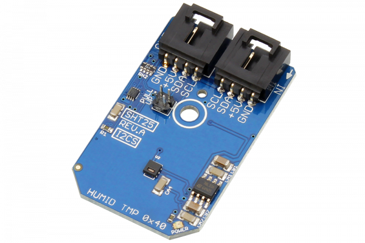

[](https://store.ncd.io/product/sht25-humidity-and-temperature-sensor-%C2%B11-8rh-%C2%B10-2c-i2c-mini-module/).

#  SHT25

The SHT25 high-accuracy humidity and temperature sensor (from Sensirion) has become an industry standard in terms of form factor and intelligence, providing calibrated, linearized sensor signals in digital, I2C format.
This Device is available from www.ncd.io 

[SKU: SHT25]

(https://store.ncd.io/product/sht25-humidity-and-temperature-sensor-%C2%B11-8rh-%C2%B10-2c-i2c-mini-module/)
This Sample code can be used with Raspberry Pi.

Hardware needed to interface SHT25 humidity and temperature sensor With Raspberry Pi :
1. <a href="https://store.ncd.io/product/sht25-humidity-and-temperature-sensor-%C2%B11-8rh-%C2%B10-2c-i2c-mini-module/">SHT25 humidity and temperature sensor</a>
2.  <a href="https://store.ncd.io/product/i2c-shield-for-raspberry-pi-3-pi2-with-outward-facing-i2c-port-terminates-over-hdmi-port/">Raspberry Pi I2C Shield</a>
3. <a href="https://store.ncd.io/product/i%C2%B2c-cable/">I2C Cable</a>

## Python
Download and install smbus library on Raspberry pi. Steps to install smbus are provided at:

https://pypi.python.org/pypi/smbus-cffi/0.5.1

Download (or git pull) the code in pi. Run the program.

```cpp
$> python SHT25.py
```
The lib is a sample library, you will need to calibrate the sensor according to your application requirement.
